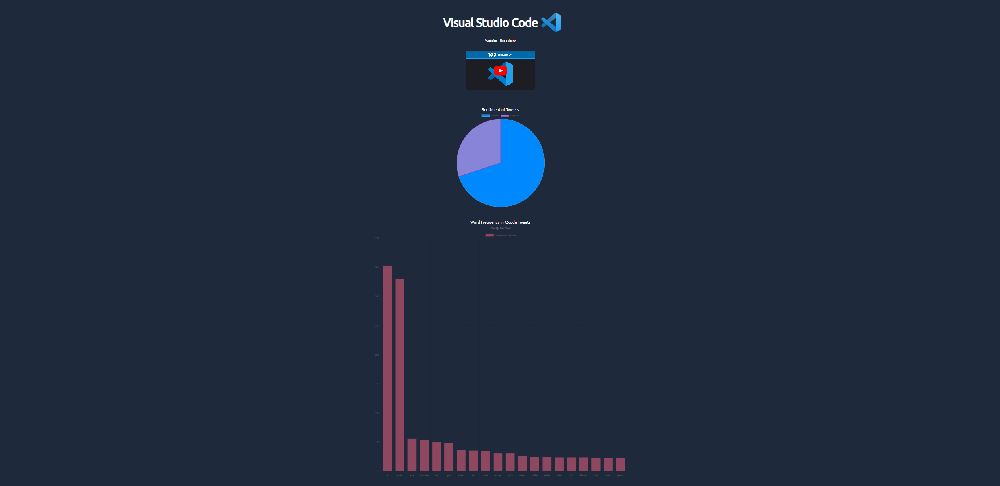

# Web Dev Evaluator

A full-stack application built with Next.js and Rust to help you get sentiment and statistics data for over 90 different web development technologies.

   

## Getting Started

These instructions will get you a copy of the project up and running on your local machine for development and testing purposes.

#### Prerequisites

- Node.js
- Rust
- Python
- MongoDB

#### Installing

1. Clone the repository to your local machine
2. Install the dependencies
3. Provide a string in a .env file called RUSTKEY, it can be any string.
4. Start the development server with npm run dev, it will be live at localhost:3000.
5. Clone the Rust server to your local machine: [here](https://github.com/wesngu28/rustwde)
6. You will need to make a .env with the following environment variables:
- mongo_username: Your MongoDB service account username
- cluster: Name of the cluster
- mongo_password: Password to the MongoDB account
- GH_TOKEN: Github personal token with public repo access
- API_Key: Same as RUSTKEY
7. Use cargo run to build and launch the backend.
8. Gather and analyze the latest tweets by running pip install, then python main.py in the assets folder.
9. After the above, the frontend should now show various information when clicking technologies.

#### Built With

- [TypeScript](https://www.typescriptlang.org/): A statically typed superset of JavaScript that adds optional types, classes, and interfaces.
- [Next.js](https://nextjs.org/): A framework for building production-ready React applications.
- [Tailwind](https://tailwindcss.com/): A utility-first CSS framework for rapidly building custom designs.
- [d3.js](https://d3js.org/): A JavaScript library for data visualization and manipulation.
- [Python](https://www.python.org/): A high-level programming language used for web development, scientific computing, data analysis, and more.
- [Rust](https://www.rust-lang.org/): A systems programming language that runs blazingly fast, prevents segfaults, and guarantees thread safety.
- [Axum](https://github.com/tokio-rs/axum): A high-level language for writing concurrent, asynchronous, and parallel systems.